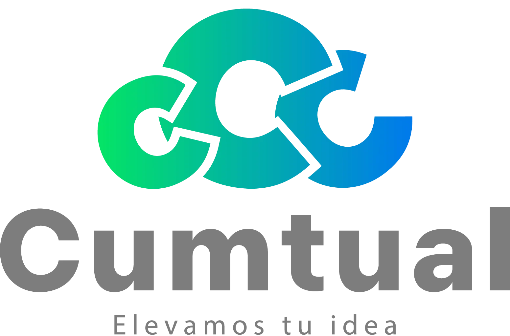

<div align="center">
  <picture>
    <source media="(prefers-color-scheme: dark)" srcset="./public/logocumtual-23.webp">
    
  </picture>
  <h1 align="center">Cumtual — Página Web Corporativa</h1>
  <p align="center">
    Sitio web bilingüe (español/inglés) para <strong>Cumtual</strong>, desarrollado con Astro, React y Tailwind CSS.
    <br />
    <a href="https://cumtual.com"><strong>🌐 Visitar el sitio »</strong></a>
  </p>
</div>

<br />

<!-- TECH BADGES -->
<div align="center">

  
  
  
  
  
  
  
  

</div>

<br />

---

## 📋 Tabla de Contenidos

- [Tecnologías](#-tecnologías)
- [Estructura del Proyecto](#-estructura-del-proyecto)
- [Primeros Pasos](#-primeros-pasos)
- [Comandos](#-comandos)
- [Características](#-características)
- [Rutas](#-rutas)

---

## 🛠️ Tecnologías

| Tecnología | Propósito |
|---|---|
| **[Astro](https://astro.build)** | Framework principal — sitios rápidos con poca o nada de JavaScript al cargar |
| **[React 18](https://react.dev)** | Componentes interactivos (formularios, sliders, menús) |
| **[TypeScript](https://www.typescriptlang.org)** | Tipado estático para un código más seguro y mantenible |
| **[Tailwind CSS](https://tailwindcss.com)** | Estilizado utilitario, rápido y responsivo |
| **[Framer Motion](https://www.framer.com/motion)** | Animaciones fluidas y transiciones en React |
| **[Nanostores](https://github.com/nanostores/nanostores)** | Store reactivo atómico para estado compartido |
| **[React Hook Form](https://react-hook-form.com)** | Manejo eficiente de formularios con validación |
| **[AOS](https://michalsnik.github.io/aos)** | Animaciones al hacer scroll |
| **[Axios](https://axios-http.com)** | Cliente HTTP para peticiones al backend |
| **[Partytown](https://partytown.builder.io)** | Ejecución de scripts de terceros en un worker |
| **[Cloudflare](https://cloudflare.com)** | Despliegue y hosting con edge network |
| **[Sharp](https://sharp.pixelplumbing.com)** | Optimización de imágenes en build |
| **[Sitemap](https://github.com/astrojs/sitemap)** | Generación automática de sitemap XML |

---

## 📁 Estructura del Proyecto

```
/
├── public/                        # Archivos estáticos (imágenes, SVGs)
│   ├── logocumtual-23.webp        # Logo principal de Cumtual
│   ├── imagenes-herramientas/     # Iconos de herramientas
│   └── *.svg                      # Recursos vectoriales
│
├── src/
│   ├── components/
│   │   ├── ComponentesES/         # Componentes en español
│   │   │   ├── Header.astro
│   │   │   ├── NavBar.tsx
│   │   │   ├── Formulario.tsx
│   │   │   ├── ServiciosSlider.tsx
│   │   │   └── ...
│   │   ├── ComponentesEN/         # Componentes en inglés
│   │   │   ├── ContactUs.astro
│   │   │   └── Form.tsx
│   │   ├── SVG/                   # Componentes SVG reutilizables
│   │   ├── UI/                    # Componentes de interfaz
│   │   ├── botonHeaderMX/         # Botón de cambio de idioma
│   │   └── Footer.astro
│   │
│   ├── layouts/                   # Layouts base (ES, EN, general)
│   ├── pages/                     # Rutas de la aplicación
│   │   ├── es-MX/                 # Versiones en español
│   │   │   ├── index.astro
│   │   │   ├── acerca-de-nostros/
│   │   │   ├── contactanos/
│   │   │   └── servicios/
│   │   ├── en-US/                 # Versiones en inglés
│   │   │   ├── index.astro
│   │   │   ├── about-us/
│   │   │   ├── contact-us/
│   │   │   └── services/
│   │   └── 404.astro
│   │
│   └── styles/
│       ├── globals.css            # Estilos globales
│       └── prototype.css          # Estilos de prototipado
│
├── astro.config.mjs               # Configuración de Astro
├── tailwind.config.js             # Configuración de Tailwind
├── tsconfig.json                  # Configuración de TypeScript
├── package.json
└── README.md
```

---

## 🚀 Primeros Pasos

### Requisitos

- **Node.js** >= 18
- **npm** (incluido con Node.js)

### Instalación

```bash
# 1. Clonar el repositorio
git clone https://github.com/tu-usuario/pagina-cumtual.git
cd pagina-cumtual

# 2. Instalar dependencias
npm install

# 3. Iniciar servidor de desarrollo
npm run dev
```

El servidor se iniciará en `http://localhost:4321` 🎉

---

## ⌨️ Comandos

| Comando | Acción |
|---|---|
| `npm install` | Instala las dependencias del proyecto |
| `npm run dev` | Inicia servidor de desarrollo en `localhost:4321` |
| `npm run build` | Compila el sitio de producción en `./dist/` |
| `npm run preview` | Previsualiza el build localmente antes de deploy |
| `npm run astro -- --help` | Ayuda sobre la CLI de Astro |
| `npx astro dev --host` | Levanta el servidor en la red local |

---

## ✨ Características

- 🌎 **Bilingüe** — Sitio completo en español (es-MX) e inglés (en-US) con cambio de idioma
- 📱 **Responsivo** — Diseño adaptable a móvil, tablet y escritorio
- 🎨 **Animaciones** — Transiciones suaves con Framer Motion y AOS
- 📬 **Formularios** — Formulario de contacto con validación mediante React Hook Form
- ⚡ **Rendimiento** — Optimizado con Astro, imágenes con Sharp y minificación en build
- 🗺️ **SEO** — Sitemap automático y meta tags
- 🔒 **Privacidad** — Scripts de terceros ejecutados en worker con Partytown
- 🖼️ **SVG** — Componentes SVG nativos para iconos e insignias
- 🧠 **Store** — Estado compartido con Nanostores (menú, idioma, etc.)

---

## 🗺️ Rutas

### Español (`/es-MX/`)
| Ruta | Página |
|---|---|
| `/es-MX/` | Inicio |
| `/es-MX/acerca-de-nostros/` | Acerca de nosotros |
| `/es-MX/contactanos/` | Contacto |
| `/es-MX/servicios/desarrollo-web-a-la-medida/` | Desarrollo Web a la Medida |
| `/es-MX/servicios/almacenamiento-en-la-nube/` | Almacenamiento en la Nube |
| `/es-MX/servicios/portafolio-logos/` | Portafolio de Logos |

### Inglés (`/en-US/`)
| Ruta | Página |
|---|---|
| `/en-US/` | Home |
| `/en-US/about-us/` | About Us |
| `/en-US/contact-us/` | Contact Us |
| `/en-US/services/custom-web-development/` | Custom Web Development |
| `/en-US/services/cloud-storage/` | Cloud Storage |
| `/en-US/services/logos/` | Logos Portfolio |

---

<div align="center">
  <sub>Hecho con ❤️ por el equipo de Cumtual</sub>
  <br />
  <sub>© 2025 Cumtual. Todos los derechos reservados.</sub>
</div>
